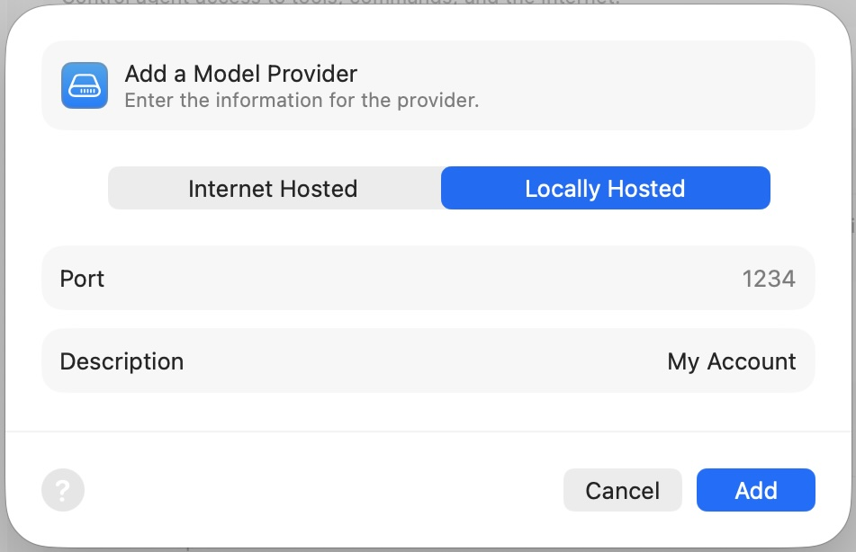
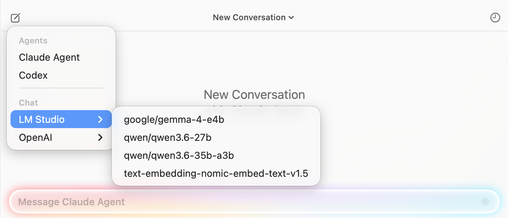
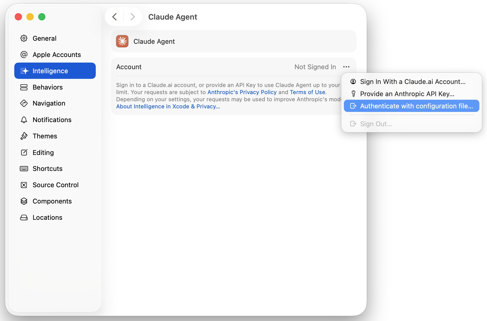
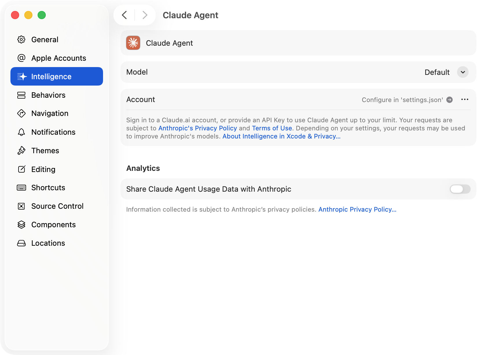
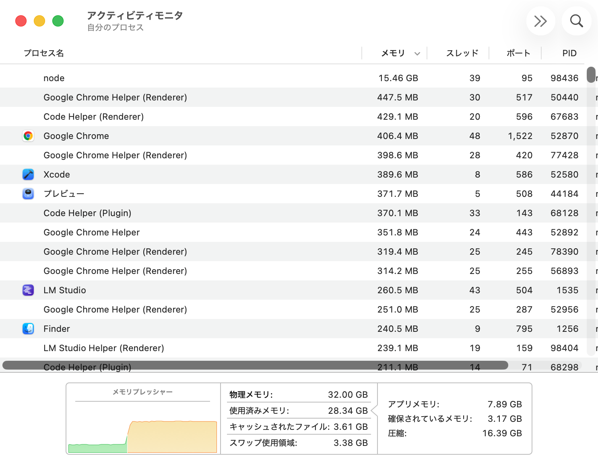
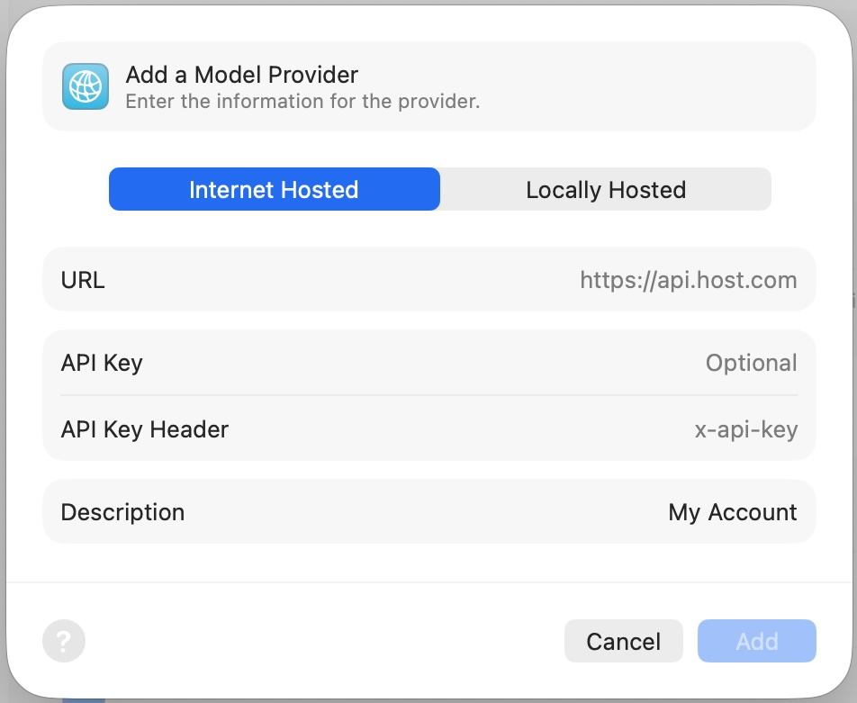
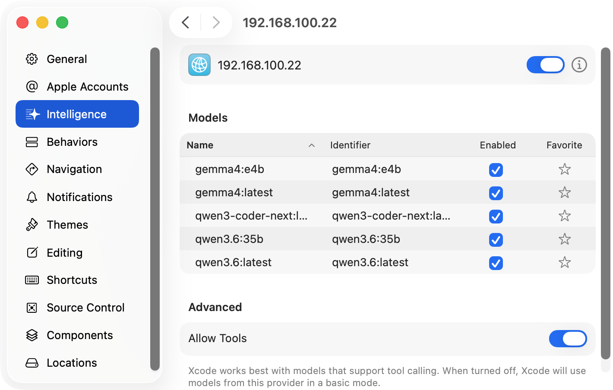

<header>

# 自作 PC で始めるローカル LLM を利用した Xcode のコード自動生成

<div class="author-info">
江本光晴<BR />
ゆめみ（アクセンチュア株式会社）
</div>

</header>

Xcode 26 から AI 機能が搭載され、Xcode はコード生成ができるようになりました。今や生成 AI は開発に欠かせない存在です。一方で、そのコード生成に利用されるクラウド型 AI サービスは、プランによる利用上限や従量課金といったコスト、政治判断による影響などの課題があります。また、学習無効に設定していても、ソースコードや設計情報は外部に送信されるため、セキュリティ要件が厳しい秘匿案件での利用は難しいです。

それらの解決アプローチとして、本記事ではローカル LLM（Large Language Model / 大規模言語モデル）を利用した Xcode のコード自動生成を紹介します。ローカル LLM はローカル環境内で LLM 推論するため、利用制限や情報漏洩を気にせず利用できます。

しかし、ローカル LLM を Mac 上で動作させると、大量のメモリや GPU リソースを消費します。本来の目的である Xcode の開発パフォーマンスが低下したら、意味がありません。Mac は購入後にメモリや GPU などを増設できないため、エントリーやミドルモデルなどのスペックでは、ローカル LLM は十分に動作しません。

そこで、ローカル LLM を開発機の Mac ではなく、別の PC で実行させます。その PC を LLM サーバーとしてローカルネットワーク上に構築して、Xcode で利用する方法を説明します。さらに、筆者の自作 PC 趣味を活かし、いくつかのパターンで組んだ Windows PC のベンチマークやコストを比較しながら、ローカル LLM を運用できる現実的なハードウェアについても考察します。

なお、本記事はすべてのクラウド LLM をローカル LLM に置き換えを提案するものではありません。両者は共に同じ LLM ですが、性能や特性は異なります。お互いを理解し、それぞれが得意な領域で棲み分けるための現実解を探求します。

### 対象読者

- Xcode 26 の AI コード生成機能を利用する方
- ローカル LLM に興味がある方
- 自作 PC にも興味がある方

### 検証環境

| 項目 | 内容 |
| :-- | :-- |
| 開発機 | MacBook Pro 14 インチ<br> M5 / メモリ 32GB / 2025 |
| macOS | macOS 26.5.1 |
| Xcode | Xcode 26.5.0 |
| ローカル LLM<br>実行環境 | LM Studio 0.4.18<br>Ollama 0.31.1 |
| 検証モデル | gemma 4 (12B / 27B など)<br>qwen 3.6 (27B / 35B など)<br>ornith 1.0 (9B / 35B など) |

### 免責事項

本記事は 2026 年 7 月上旬の情報を元にしています。これらの情報の運用は、ご自身の責任と判断によって行なってください。運用の結果について、筆者は責任を負わないものとします。

本記事に登場するシステムや製品などの名称は、一般に各社の商標または登録商標です。本記事は、©︎、®︎や™️などの表記を省略します。

## Xcode 26 の AI コード生成機能

Xcode 26 から AI 機能が組み込まれました。これまでサードパーティのエディタやツールに頼っていましたが、Xcode 単体で AI が利用できるようになりました。プロジェクト構造や Swift のビルド情報を Xcode 自身が把握しているため、コンテキストの受け渡しが自然に行われる点が強みです。

### Intelligence の選択

Xcode 26 から Chat 機能、遅れて Xcode 26.3 から Agent 機能が追加されました。Agent の登場によって、より本格的なコード生成ができるようになりました。執筆時点で利用できる AI のモデルプロバイダは、Anthropic と OpenAI です。

それら以外のモデルプロバイダを利用したい場合、Chat は接続先 URL（API）を設定して追加できます。一方 Agent は、現時点でモデルプロバイダを追加する機能は用意されていません。既存の Agent の設定ファイルを編集して、Agent のバックエンドに外部プロバイダが利用できます。

## クラウド型 AI サービスの制約

開発において、生成 AI は欠かせないです。主流の生成 AI サービスはクラウドで提供されます。利便性が高い一方で、次のような制約があります。

### 課金と利用制限

各サービスは契約プランごとに利用制限があります。たとえば、一定期間あたりのリクエスト数やトークン量に上限があります。その上限に達すると、一定時間待つ、追加クレジットを購入する、上位プランに切り替えるなどの対応が必要になります。また API を利用する場合は従量課金になります。コード生成のように長いコンテキストを頻繁に送るケースでは、想定以上に大きなコストが短時間で発生します。

今年 6 月に先行公開された Claude Fable 5 は、政治的な判断から予定より早く公開停止されました。AI 利用は、いくら課金していても、生殺与奪の権は他者（さらには国）に握られています。

### 利用モデルの制御

クラウドサービスのモデルは予告なくアップデートされます。昨日までよいコードを生成していたのに、今日から微妙になったという経験をした方も多いのではないでしょうか。

モデルのバージョンを固定できない、あるいは固定できても旧バージョンの提供はいずれ終了します。一般的にバージョンが上がれば性能は向上しますが、AI の内部は確率論であるため、期待した結果や精度が常に取得できるとは限りません。

### 外部ネットワークへの情報送信

これが最大の課題になるでしょう。多くのサービスは「入力データを学習に利用しない」という設定を提供していますが、「入力データを外部ネットワークに送信しない」ではありません。

推論するため、ソースコードや設計情報は外部の推論サーバーに送信されます。これは契約や規約レベルでどう保護されていても、外部ネットワークに送信されるという事象は回避できません。

- 顧客との契約でソースコードおよび関連情報の外部サーバーへ送信が禁止されている
- 金融・医療など、データの持ち出しに厳格な規制がある
- 未発表プロダクトやサービスの情報漏洩リスクを最小化したい

このような秘匿案件では、クラウド型 AI の利用が承認されないケースは珍しくありません。AI を利用すれば短時間で終わるタスクを長々と時間をかけて手作業で行う、AI 開発を味わってしまった現在の開発者には苦行です。

## ローカル LLM

ローカル LLM とは、自身のローカル環境で動作する大規模言語モデルです。一般公開されているオープンウェイトモデルをダウンロードして、ローカル環境の CPU や GPU で推論します。

- プロンプトや生成結果もローカルで完結するので、ネットワークを遮断した環境でも動作する
- 何度利用しても制限はなく、追加コストはかからない（PC パーツや電気代は除く）
- 自身が選択したモデルやバージョンを利用し続けられる
- 量子化レベルやコンテキスト長など、細かなパラメータを自身で制御できる

### ローカル LLM の性能

少し前のローカル LLM は、実用には難しい精度や性能でした。しかし、ここ最近公開されたオープンウェイトモデルは、性能が大きく向上しました。依然として主要なクラウド LLM には及ばないものの、コード生成タスクをこなせる水準には到達しました。LLM のベンチマーク比較サイト [^artificialanalysis] を参照すると、現在のローカル LLM のスコアは、クラウド LLM の前世代に近いレベルです。

[^artificialanalysis]: https://artificialanalysis.ai/models

本記事で取り上げるオープンウェイトモデルを紹介します。ここで B は Billion（10 億）であり、パラメータの数を示します。たとえば、30B は 300 億個のパラメータを意味します。

#### Gemma 4

Google が開発する軽量なモデル [^gemma-4] です。8B、12B や 31B など種類が多い。指示追従性が高く、日本語も堪能です。GPT-4.1 などに近い評価 [^gemma-4-31b-vs-gpt-4-1] です。

[^gemma-4]: https://ai.google.dev/gemma/docs/core/model_card_4?hl=ja
[^gemma-4-31b-vs-gpt-4-1]: https://benchlm.ai/compare/gemma-4-31b-vs-gpt-4-1

#### Qwen 3.6

Alibaba が開発するモデル [^qwen] です。コーディング性能に定評があり、国内 LLM のベースにも利用されます。Claude Sonnet 4.6 同等の評価 [^claude-sonnet-4-6-vs-qwen3-6-27b] です。

[^qwen]: https://www.alibabacloud.com/ja/solutions/generative-ai/qwen?_p_lc=1
[^claude-sonnet-4-6-vs-qwen3-6-27b]: https://benchlm.ai/compare/claude-sonnet-4-6-vs-qwen3-6-27b

#### Ornith 1.0

DeepReinforce が開発するコーディング特化のモデル [^ornith_1_0] です。Gemma 4 と Qwen 3.5 を元に開発され、Claude Opus 4.7 同等と評価されています。

[^ornith_1_0]: https://deep-reinforce.com/ornith_1_0.html

### ローカル LLM の実行環境

ローカル LLM を動かすためのランタイムはいくつかありますが、本記事は代表的な２つを採用しました。どちらも LLM をローカル環境で実行するためのオープンソースの推論エンジン llama.cpp [^llama-cpp] を内部で実行しています。

[^llama-cpp]: https://llama-cpp.com/

| ツール | 特徴 |
| :-- | :-- |
| <span class="nowrap">LM Studio [^lmstudio]</span> | GUI が充実して、モデルの検索・ダウンロード・サーバー起動までマウス操作で完結する。初学者にお勧めです。 |
| <span class="nowrap">Ollama [^ollama]</span> | 基本的に CLI ベースで操作します。`ollama run`でモデルを実行する。サーバー用途・自動化に向いている。 |

これら両者は OpenAI 互換の API サーバー機能を内蔵しています。Xcode 26 はこの互換 API に接続できるので、どちらを選択しても本記事の手順は利用できます。

[^lmstudio]: https://lmstudio.ai/
[^ollama]: https://ollama.com/

#### モデルのメモリ削減と負荷軽減

モデルのパラメータが 32B（320 億）の場合、単純計算で 1 パラメータは 16 bit（2 byte）なので、約 64 GB のメモリが必要です。家庭用 PC には大きな負担です。そこで有効な技術が量子化です。モデルの重みを低ビット化することで、メモリ使用量を抑えられます。一般的な Q4（4 ビット量子化）は、品質劣化をできるだけ抑えつつ、メモリを大きく削減できます。理論上は 1/4 ですが、実際は KV キャッシュや実行時バッファなどがあるので、64 GB のモデルは約 21 GB になります。

さらに MoE（Mixture of Experts / 混合エキスパート）という技術があります。これはモデルの中に複数の小さな専門家ネットワークを配置し、入力に応じて必要な専門家だけで計算します。たとえば、総パラメータが 32B でも、計算に利用されるのはその一部（仮に 8B など）になります。これにより、巨大モデル並みの賢さを維持しながら、軽量モデル並みの計算コストになります。

## Xcode とローカル LLM の接続

手元の Mac で LM Studio または Ollama を利用してローカル LLM を立ち上げ、Xcode から利用します。ツールの詳しいインストールや利用方法はそれぞれの公式サイトに譲りますが、次のようにすればローカル LLM が利用できます。

- LM Studio はマウス操作してモデルを選択する
- Ollama はターミナルからコマンドを打つ

```shell
ollama run qwen3.6
```

### Chat にローカル LLM を設定する

先述どおり、Chat にローカル LLM を追加できます。手順の途中で Internet Hosted がありますが、これは後々説明します。

1. Xcode の Settings の Intelligence を開く
2. Add a Model Provider を選択する
3. プロバイダ種別で Locally hosted を選び、次の内容を入力する
   - Port: LM Studio なら 1234、Ollama なら 11434（それぞれのポート初期値）
   - Description: LM Studio や Ollama など任意の名前
   
4. Coding Assistant の画面右上のモデルセレクタで、登録したローカルモデルを選択する
  

この手順で、ローカル LLM を Xcode で利用できます。チャットで「この画面でカウンターアプリを作って」のように依頼すると、クラウド型と同様にローカル LLM が対応します。

### Agent にローカル LLM を設定する

新たに Agent を追加する方法は提供されていません。ローカル LLM を利用する場合は、既存の Agent の設定を変更することで、対応します。Claude Agent の例を紹介します。

1. Xcode の Settings の Intelligence を開く
1. Claude Agent を選択する
1. Account で Authenticate with configuration file を選択する
  
1. settings.json が編集できるようになる
  
1. settings.json を次のように設定する

```json
{
  "env": {
    "ANTHROPIC_AUTH_TOKEN": "lmstudio",
    "ANTHROPIC_BASE_URL": "http://localhost:1234"
  }
}
```

これで Claude Agent は Opus や Sonnet ではなく、指定したローカル LLM をバックエンドとして利用します。Claude Agent はローカル LLM を利用して、アプリを実装します。

そこで GitHub のリポジトリを検索する iOS アプリの作成指示書を与えました。順調にアプリを開発していましたが、作成途中でローカル LLM の推論がクラッシュしました。

### ローカル LLM の負荷

モデル qwen3.6 27B Q4（サイズ 16 GB）をマウントしたときのメモリ使用量を示します。



私の MacBook はメモリ 32 GB と個人利用は十分なサイズですが、ローカル LLM を利用すると、メモリのほとんどが消費されました。今回選択したモデルはローカル LLM では小さい方の部類です。つまり、購入時のカスタマイズでメモリを少し増やした程度では、ローカル LLM には不十分です。

## ローカル LLM サーバー

Mac は購入後にメモリ増設はできません。以前あった破格な 512 GB モデルはなくなり、さらに昨今の DRAM の価格高騰により、大容量メモリの Mac の入手は難しいです。そこで発想を変えて、LLM の実行を開発機の Mac から切り離します。

### アーキテクチャ

構成はシンプルです。ローカルネットワーク上にローカル LLM 推論マシンを配置します。そのマシンは Mac とは異なり、スペックのカスタマイズ性を持ちます。Mac の Xcode から、そのマシンの OpenAI 互換 API に接続します。このアプローチの利点は次のとおりです。

- 開発機 Mac はメモリや GPU を LLM 推論で消費せず、開発に専任できる
- 推論はすべて LAN 内で完結するので、外部送信しないという利点は維持される
- LM Studio などは Windows / macOS / Linux をサポートするので、マシンを自由に設計できる
- 小中規模のローカル LLM なら、何とか個人で対応スペックを用意できる（要出典）
- 目的が増えて、大義名分で自作 PC を組める

### Xcode とローカル LLM サーバー

Xcode とローカル LLM サーバーの接続は簡単です。LM Studio と Ollama はサーバー機能を備えています。両者とも設定からローカルサーバー機能を有効にします。

Chat は前述の手順にあった Internet Hosted で、ローカル LLM サーバーのローカル IP アドレスとポート番号（`192.168.100.38:1234`など）を指定します。API Key などの初期値は未設定なので、適当な値でよいです。



Agent も同様に settings.json で localhost をローカル IP アドレスに書き換えます。これにより、先ほどクラッシュした Agent とローカル LLM は最後まで実装できました（詳細は後述を参照）。

## ローカル LLM に最適な自作 PC

私は自作 PC を趣味としており、今回いくつかのパターンで自作 PC を組みました。それらのベンチマークから、最適な構成を考えます。

LLM にもっとも影響するパーツは GPU です。本来は他パーツを固定して、GPU だけを入れ替えて計測するのが望ましいです。しかし、私の日常利用と自作ポリシーにより、構成はそれぞれ異なります。ご了承ください。なお、スペックはそれぞれミドルからミドルハイのレンジです。

### 検証機の比較

自作した検証機の構成と計測結果を表１にまとめました。ゲームなどで日常利用してるメイン PC、余剰パーツなどで組んだサブ PC たちです。また、今回のローカル LLM に向けて、私がこれなら十分だろうと組んだ検証機 [^qiita-local-llm-pc] もあります。それぞれ Windows 11 を採用して、パーツは中古、アウトレットやジャンクなどを多用しています。本当は DDR5 のメモリ（RAM）を多く載せたかったのですが、昨今の価格沸騰で断念しています。

[^qiita-local-llm-pc]: https://qiita.com/mitsuharu_e/items/92a3eccb65d9b5c4ceca

<figure class="column-top">
<figcaption>検証機の構成と計測結果</figcaption>

| <span class="nowrap">構成</span> | A | B | C | D | E |
| :-- | :-- | :-- | :-- | :-- | :-- |
| CPU | Intel<br>i7 12700 | Ryzen<br>7 5700X | Ryzen<br>7 7700 | Intel<br>i7 13700 | Intel<br>i5 14400 |
| RAM | DDR4<br>64 GB | DDR4<br>64 GB | DDR5<br>32 GB | DDR5<br>32 GB | DDR4<br>128 GB |
| GPU | Intel<br>Arc B580<br>12 GB | Radeon<br>RX 9060 XT<br>16 GB | GeForce<br>RTX 5060 Ti<br>16 GB | GeForce<br>RTX 4070 Ti<br>12 GB | Radeon<br>AI PRO R9700<br>32 GB（２枚） |
| <b>計測結果</b> | (token/sec) | | | | |
| gemma4 (9.6 GB) | 70.47 | 60.95 | 96.36 | 105.12 | 58.25 |
| qwen3.6 (24 GB) | 32.86 | 20.85 | 63.87 | 53.79 | 74.39 |

</figure>

### 性能比較

各検証機において Ollama を利用して、次のモデルを同一プロンプトで 10 回実行しました。性能指標の token/sec の平均値を計測しました。

| モデル | P | 量子化 | サイズ |
| :-- | :-- | :-- | :-- |
| gemma4 [^gemma4-e4b] | 8B | <span class="nowrap">Q4_K_M</span> | 9.6 GB |
| qwen3.6 [^qwen3.6-35b] | 35B | Q4_K_M | 24 GB |

[^gemma4-e4b]: https://ollama.com/library/gemma4:e4b
[^qwen3.6-35b]: https://ollama.com/library/qwen3.6:35b

gemma4 は、どの GPU の VRAM にも収まるので、計算速度を比較します。qwen3.6 は VRAM に収まる・収まらないが起こるケースで、大きなモデルを選択したときのパフォーマンスを比較します。

### 評価

LLM のモデルは VRAM にマウントされますが、同様に RAM にもマウントされます。たとえば 30 GB のモデルを読み込むと、VRAM と RAM はそれぞれ 30 GB 以上を消費します。また VRAM が十分なサイズではない場合、VRAM は RAM とモデルデータをやり取りするため、計算速度に影響します。

gemma4 はそのような速度低下が起こらない検証です。やはりというか、前世代とはいえど RTX 4070 Ti が勝利です。予想外として、まだ歴史が浅い Arc B580 が Radeon より速い結果は驚きでした。一方で qwen3.6 では、VRAM の大きさが結果に影響しました。計算が速い GeForce より、VRAM を多く積んだ AI PRO R9700 が勝ちました。

予想どおりというべきか、利用したいモデルに対して十分なサイズの VRAM を選択するのがよいです。多少不足する場合は、速度で挽回できるコアを選択しましょう。金額面から Arc が大穴でしょうか。なお、私は Radeon を愛用しています。

計算速度に関して評価しましたが、推論結果はどれも妥当な精度でした。この検証中で qwen3.6 に「Swift Concurrency について 200 文字で説明して」と質問した結果の一例を記載します。

```txt
Swift ConcurrencyはSwift 5.5で導入された現代的な並行処理モデルです。async/await構文により非同期処理を同期的な記法で直感的に実装でき、コールバック地獄を解消します。Actorによる共有状態の安全な保護と構造化並行処理を採用し、レースコンディションを防ぎながら高効率な並列実行を実現。ネットワーク通信からUI更新まで、複雑な処理も安全かつシンプルに扱えます。
```

## ローカル LLM で iOS アプリ実装

MacBook、検証機 E そして ornith 35b [^ollama-ornith-35b] を利用して、ローカル LLM で iOS アプリを開発します。

- Chat で一画面に対して実装指示する
- Claude Agent のバックエンドとして、シンプルなアプリを実装する

[^ollama-ornith-35b]: https://ollama.com/library/ornith:35b

### 実装

Xcode で Chat および Claude Agent のバックエンドに、ローカル LLM サーバーを設定しました。



今回は Ollama を利用するので、settings.json でモデルも指定します。

```json
{
  "env": {
    "ANTHROPIC_AUTH_TOKEN": "ollama",
    "ANTHROPIC_BASE_URL": "http://192.168.100.19:11434",
    "ANTHROPIC_MODEL": "ornith:35b"
  }
}
```

紙面の都合上、実装結果は GitHub [^evaluate-local-llms-for-ios-app] の PR で公開します。対照として、ローカルの qwen 3.6、クラウドの GPT-5 / Codex でも実装しました。

[^evaluate-local-llms-for-ios-app]: https://github.com/mitsuharu/evaluate-local-llms-for-ios-app

### ローカル LLM の実装評価

ローカル LLM は、クラウドと比べると速度と品質で見劣りしますが、ornith は健闘しました。

Chat は単純なタスクを問題なくこなせたため、短く明確な指示には十分実用的だと感じました。Agent は ornith では問題なかったですが、一般的には分割して段階的に渡した方が安定します。

難易度の高い要求でなければ、ローカル LLM は実装支援に活用できます。今はクラウドのトークン消費を抑えるための補助的な利用が現実的です。

なお、実装中は検証機の GPU の消費電力とファン回転数がほぼ最大まで上がりました。LLM の計算負荷の高さを実感しました。

## まとめ

実装に利用した ornith は正直使えました。LLM のモデルとハードウェアは継続的に進化しており、いずれは本格的な開発手段になるでしょう。

私が愛用している Radeon は、計算用ドライバーの練度に伸び代があります。速度は劣るが、コストに魅力があり、今後も付き合っていきたい。
